# 🔄 TryWear - User Flow Documentation

Dokumentasi lengkap alur pengguna (User Flow) untuk aplikasi TryWear - Platform E-Commerce dengan Virtual Try-On.

---

## 📋 Daftar Isi

1. [Main Overview](#1-main-overview)
2. [Authentication Flow](#2-authentication-flow)
3. [Product Browsing Flow](#3-product-browsing-flow)
4. [Product Detail & Virtual Try-On Flow](#4-product-detail--virtual-try-on-flow)
5. [Cart Flow](#5-cart-flow)
6. [Checkout Flow](#6-checkout-flow)
7. [Payment Flow](#7-payment-flow)
8. [Order Tracking Flow](#8-order-tracking-flow)
9. [User Settings Flow](#9-user-settings-flow)
10. [Wishlist Flow](#10-wishlist-flow)
11. [Complete E-Commerce Flow](#11-complete-e-commerce-flow-end-to-end)

---

## 1. Main Overview

Gambaran umum seluruh alur aplikasi TryWear dari perspektif pengguna.

```mermaid
flowchart LR
    A["🏠 Landing Page"] --> B["📦 Product Catalog"]
    B --> C["👕 Product Detail"]
    C --> D["📷 Virtual Try-On"]
    C --> E["🛒 Add to Cart"]
    E --> F["💳 Checkout"]
    F --> G["💰 Payment"]
    G --> H["📦 Order Tracking"]

    A --> I["🔐 Login/Register"]
    I --> J["👤 User Dashboard"]
    J --> K["⚙️ Settings"]
    J --> L["📋 Order History"]
```

### Penjelasan:

- **Landing Page**: Titik awal user mengakses website
- **Product Catalog**: Melihat dan mencari produk
- **Product Detail**: Informasi lengkap produk + Virtual Try-On
- **Cart → Checkout → Payment**: Proses pembelian
- **Order Tracking**: Melacak status pesanan

---

## 2. Authentication Flow

Alur autentikasi pengguna meliputi Login, Register, dan Reset Password.

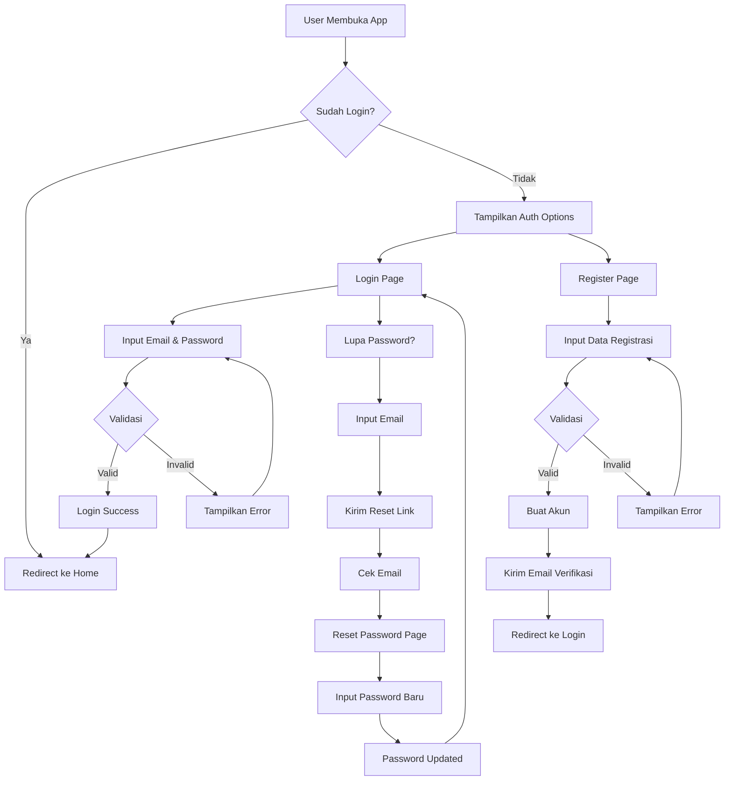

### Halaman Terkait:

| Halaman         | Path               | Deskripsi                          |
| --------------- | ------------------ | ---------------------------------- |
| Login           | `/login`           | Form login dengan email & password |
| Register        | `/register`        | Form registrasi akun baru          |
| Forgot Password | `/forgot-password` | Request reset password             |
| Reset Password  | `/reset-password`  | Set password baru                  |

---

## 3. Product Browsing Flow

Alur pengguna dalam menjelajahi dan mencari produk.

```mermaid
flowchart TD
    A["🏠 Landing Page"] --> B["Lihat Featured Products"]
    A --> C["Lihat Categories"]
    A --> D["Klik Jelajahi Koleksi"]

    B --> E["📦 Product Catalog"]
    C --> E
    D --> E

    E --> F["Filter Products"]
    E --> G["Search Products"]
    E --> H["Browse All"]

    F --> I["Filter by Category"]
    F --> J["Filter by Price"]
    F --> K["Filter by Size"]
    F --> L["Filter by Color"]

    I --> M["Hasil Filter"]
    J --> M
    K --> M
    L --> M
    G --> M
    H --> M

    M --> N{"Ada Produk?"}
    N -->|Ya| O["Tampilkan Products"]
    N -->|Tidak| P["No Results Found"]
    P --> E

    O --> Q["Klik Product Card"]
    Q --> R["👕 Product Detail Page"]
```

### Fitur Filter:

- **Category**: Atasan, Bawahan, Outerwear, dll.
- **Price Range**: Slider harga minimum-maximum
- **Size**: XS, S, M, L, XL, XXL, XXXL
- **Color**: Grey, Black, White, Navy, Olive, Blue, dll.

---

## 4. Product Detail & Virtual Try-On Flow

Alur pengguna di halaman detail produk termasuk fitur unggulan Virtual Try-On.

```mermaid
flowchart TD
    A["👕 Product Detail Page"] --> B["Lihat Gallery Produk"]
    A --> C["Lihat Info Produk"]
    A --> D["Pilih Ukuran"]
    A --> E["Pilih Warna"]
    A --> F["Atur Quantity"]

    D --> G{"Size Available?"}
    G -->|Ya| H["Size Selected"]
    G -->|Tidak| I["Out of Stock Badge"]

    E --> J{"Color Available?"}
    J -->|Ya| K["Color Selected"]
    J -->|Tidak| L["Variant Unavailable"]

    H --> M["Cek Stock Real-time"]
    K --> M

    A --> N["🔗 Panduan Ukuran"]
    N --> O["Dialog Size Guide"]
    O --> P["Lihat Tabel Ukuran"]
    P --> Q["Close Dialog"]
    Q --> A

    A --> R["📷 Virtual Try-On"]
    R --> S["Dialog Virtual Try-On"]
    S --> T{"Izin Kamera?"}
    T -->|Ya| U["Load MediaPipe Model"]
    T -->|Tidak| V["Error: No Permission"]
    V --> W["Close Dialog"]
    W --> A

    U --> X["Proses Background Removal"]
    X --> Y["Start Pose Detection"]
    Y --> Z["Render Pakaian di Tubuh"]
    Z --> AA["User Bergerak"]
    AA --> Y

    Z --> AB["Toggle Pose Landmarks"]
    Z --> AC["Capture Screenshot"]
    AC --> AD["Download PNG"]

    Z --> AE["Klik Selesai"]
    AE --> W

    M --> AF["❤️ Add to Wishlist"]
    M --> AG["🛒 Add to Cart"]
    M --> AH["⚡ Beli Sekarang"]

    AG --> AI["Cart Updated"]
    AI --> AJ["Toast: Ditambahkan ke Keranjang"]

    AH --> AG
    AH --> AK["Redirect ke Checkout"]
```

### Virtual Try-On - Detail Teknis:

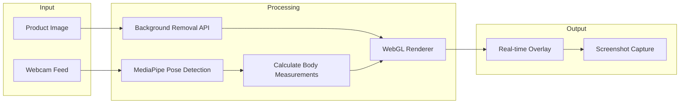

### Fitur Virtual Try-On:

| Fitur               | Deskripsi                                    |
| ------------------- | -------------------------------------------- |
| Pose Detection      | Deteksi 33 landmark tubuh dengan MediaPipe   |
| Background Removal  | Otomatis menghapus background gambar pakaian |
| Real-time Rendering | Pakaian mengikuti gerakan tubuh              |
| Mirrored View       | Tampilan seperti cermin                      |
| Screenshot          | Simpan hasil try-on sebagai PNG              |
| Debug Mode          | Toggle untuk melihat pose landmarks          |

---

## 5. Cart Flow

Alur pengelolaan keranjang belanja.

```mermaid
flowchart TD
    A["🛒 Klik Cart Icon"] --> B["Cart Sheet Opens"]

    B --> C{"Cart Kosong?"}
    C -->|Ya| D["Tampilkan Empty State"]
    D --> E["Klik Mulai Belanja"]
    E --> F["Redirect ke Products"]

    C -->|Tidak| G["Tampilkan Cart Items"]

    G --> H["Lihat Item Details"]
    H --> I["Gambar, Nama, Size, Color"]
    H --> J["Harga per Item"]
    H --> K["Quantity"]

    K --> L["Klik Minus"]
    L --> M{"Quantity > 1?"}
    M -->|Ya| N["Quantity - 1"]
    M -->|Tidak| O["Remove Item?"]
    O -->|Ya| P["Item Dihapus"]
    O -->|Tidak| Q["Stay"]

    K --> R["Klik Plus"]
    R --> S{"Stock Available?"}
    S -->|Ya| T["Quantity + 1"]
    S -->|Tidak| U["Max Stock Reached"]

    G --> V["Lihat Subtotal"]
    G --> W["Klik Remove Item"]
    W --> P

    P --> X["Cart Updated"]
    N --> X
    T --> X

    G --> Y["Lanjut ke Checkout"]
    Y --> Z["💳 Checkout Page"]
```

### Informasi yang Ditampilkan di Cart:

- Gambar produk
- Nama produk
- Ukuran & Warna yang dipilih
- Harga per unit
- Quantity dengan +/- control
- Subtotal per item
- Total keseluruhan

---

## 6. Checkout Flow

Alur proses checkout sebelum pembayaran.

```mermaid
flowchart TD
    A["💳 Checkout Page"] --> B{"User Logged In?"}

    B -->|Tidak| C["Redirect ke Login"]
    C --> D["Login Success"]
    D --> A

    B -->|Ya| E["Load Cart Items"]
    E --> F["Tampilkan Order Summary"]

    A --> G["📍 Pilih Alamat"]
    G --> H{"Ada Alamat?"}
    H -->|Ya| I["Pilih dari Daftar"]
    H -->|Tidak| J["Tambah Alamat Baru"]
    J --> K["Form Alamat"]
    K --> L["Simpan Alamat"]
    L --> I

    I --> M["Alamat Terpilih"]

    A --> N["🚚 Pilih Shipping Method"]
    N --> O["Reguler / Express"]
    O --> P["Hitung Ongkir"]

    A --> Q["🎟️ Input Kupon"]
    Q --> R{"Ada Kupon?"}
    R -->|Input Manual| S["Ketik Kode Kupon"]
    R -->|Pilih Tersedia| T["Lihat Kupon Available"]

    S --> U["Klik Gunakan"]
    T --> U
    U --> V{"Kupon Valid?"}
    V -->|Ya| W["Apply Discount"]
    W --> X["Update Total"]
    V -->|Tidak| Y["Error: Kupon Invalid"]
    Y --> Q

    F --> Z["Subtotal + Tax + Shipping - Discount"]
    Z --> AA["Total Final"]

    M --> AB{"Ready to Checkout?"}
    AA --> AB

    AB -->|Ya| AC["Klik Tempatkan Pesanan"]
    AC --> AD["Buat Order di Database"]
    AD --> AE["Redirect ke Payment"]
    AE --> AF["💰 Midtrans Payment Page"]
```

### Komponen Checkout:

| Komponen          | Deskripsi                                  |
| ----------------- | ------------------------------------------ |
| Address Selector  | Pilih atau tambah alamat pengiriman        |
| Shipping Method   | Pilih metode pengiriman                    |
| Coupon Input      | Input kode kupon manual                    |
| Available Coupons | Dropdown kupon yang tersedia               |
| Segment Discount  | Diskon otomatis berdasarkan level customer |
| Order Summary     | Ringkasan pesanan dengan price breakdown   |

### Price Breakdown:

```
Subtotal:           Rp XXX.XXX
Pajak (10%):        Rp XX.XXX
Biaya Pengiriman:   Rp XX.XXX
Diskon Segmen:     -Rp X.XXX
Diskon Kupon:      -Rp X.XXX
─────────────────────────────
Total:              Rp XXX.XXX
```

---

## 7. Payment Flow

Alur proses pembayaran melalui Midtrans.

```mermaid
flowchart TD
    A["💰 Payment Page"] --> B["Midtrans Popup/Redirect"]

    B --> C["Pilih Metode Pembayaran"]
    C --> D["Credit Card"]
    C --> E["Bank Transfer"]
    C --> F["E-Wallet"]
    C --> G["Convenience Store"]

    D --> H["Input Card Details"]
    E --> I["Pilih Bank"]
    F --> J["Pilih E-Wallet"]
    G --> K["Pilih Gerai"]

    H --> L["Process Payment"]
    I --> M["Generate VA Number"]
    J --> N["Redirect ke App Wallet"]
    K --> O["Generate Payment Code"]

    L --> P{"Payment Success?"}
    M --> Q["User Transfer Manual"]
    N --> R["Konfirmasi di App"]
    O --> S["Bayar di Gerai"]

    Q --> T["Midtrans Verifikasi"]
    R --> T
    S --> T

    T --> P

    P -->|Ya| U["Payment Callback"]
    P -->|Tidak| V["Payment Failed"]

    U --> W["Update Order Status: Paid"]
    W --> X["Kirim Notifikasi"]
    X --> Y["Redirect ke Order Success"]
    Y --> Z["📦 Order Tracking Page"]

    V --> AA["Tampilkan Error"]
    AA --> AB["Coba Lagi / Cancel"]
    AB -->|Coba Lagi| B
    AB -->|Cancel| AC["Redirect ke Home"]
```

### Metode Pembayaran yang Didukung:

| Kategori          | Metode                          |
| ----------------- | ------------------------------- |
| Credit Card       | Visa, Mastercard, JCB           |
| Bank Transfer     | BCA, BNI, BRI, Mandiri, Permata |
| E-Wallet          | GoPay, OVO, Dana, ShopeePay     |
| Convenience Store | Alfamart, Indomaret             |

---

## 8. Order Tracking Flow

Alur pelacakan pesanan dan pengelolaan order.

```mermaid
flowchart TD
    A["📦 My Orders Page"] --> B["Lihat Daftar Pesanan"]

    B --> C["Filter by Status"]
    C --> D["Semua"]
    C --> E["Pending"]
    C --> F["Processing"]
    C --> G["Shipped"]
    C --> H["Delivered"]
    C --> I["Cancelled"]

    D --> J["Tampilkan Orders"]
    E --> J
    F --> J
    G --> J
    H --> J
    I --> J

    J --> K["Klik Order Card"]
    K --> L["Order Detail Page"]

    L --> M["Order Info"]
    M --> N["Order ID"]
    M --> O["Tanggal Order"]
    M --> P["Status"]

    L --> Q["Items Ordered"]
    Q --> R["Product, Qty, Price"]

    L --> S["Alamat Pengiriman"]
    L --> T["Payment Info"]

    P --> U{"Status = Shipped?"}
    U -->|Ya| V["Tracking Number"]
    V --> W["Lacak Pengiriman"]

    P --> X{"Status = Delivered?"}
    X -->|Ya| Y["Beri Review"]
    Y --> Z["Review Form"]
    Z --> AA["Submit Review"]
    AA --> AB["Review Saved"]

    L --> AC{"Eligible for Return?"}
    AC -->|Ya| AD["Request Return"]
    AD --> AE["Form Return"]
    AE --> AF["Upload Bukti"]
    AF --> AG["Submit Return Request"]
    AG --> AH["Return Status: Requested"]
```

### Order Status Timeline:

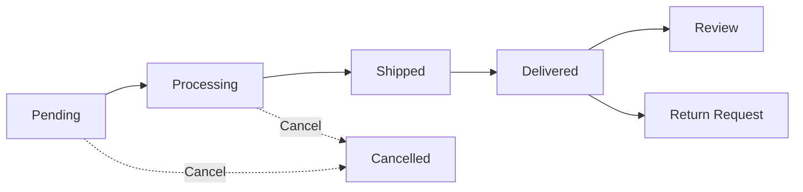

### Status Order:

| Status     | Deskripsi           | Aksi User       |
| ---------- | ------------------- | --------------- |
| Pending    | Menunggu pembayaran | Bayar / Cancel  |
| Processing | Sedang diproses     | Tunggu          |
| Shipped    | Dalam pengiriman    | Lacak           |
| Delivered  | Sudah diterima      | Review / Return |
| Cancelled  | Dibatalkan          | -               |

---

## 9. User Settings Flow

Alur pengelolaan akun dan pengaturan pengguna.

```mermaid
flowchart TD
    A["👤 User Settings"] --> B["Sidebar Menu"]

    B --> C["📝 Profile"]
    B --> D["📍 Addresses"]
    B --> E["📋 Orders"]
    B --> F["🔔 Notifications"]
    B --> G["🔐 Security"]

    C --> H["Edit Profile Form"]
    H --> I["Nama"]
    H --> J["Email"]
    H --> K["Foto Profil"]
    K --> L["Upload Image"]
    L --> M["Save Changes"]

    D --> N["Daftar Alamat"]
    N --> O["Set Default Address"]
    N --> P["Edit Address"]
    N --> Q["Delete Address"]
    N --> R["Add New Address"]

    R --> S["Form Alamat"]
    S --> T["Nama Penerima"]
    S --> U["Alamat Lengkap"]
    S --> V["Kota, Provinsi, Kode Pos"]
    S --> W["No. Telepon"]
    S --> X["Label: Rumah/Kantor"]
    X --> Y["Save Address"]

    E --> Z["Redirect ke Orders Page"]

    F --> AA["Notification Settings"]
    AA --> AB["Toggle Email Notifications"]
    AA --> AC["Toggle Push Notifications"]

    G --> AD["Change Password"]
    AD --> AE["Current Password"]
    AD --> AF["New Password"]
    AD --> AG["Confirm Password"]
    AG --> AH["Update Password"]

    G --> AI["Active Sessions"]
    AI --> AJ["Lihat Device yang Login"]
    AJ --> AK["Logout dari Device Lain"]
```

### Halaman Settings:

| Menu          | Path                           | Deskripsi                |
| ------------- | ------------------------------ | ------------------------ |
| Profile       | `/user/settings/profile`       | Edit nama, email, foto   |
| Addresses     | `/user/settings/addresses`     | Kelola alamat pengiriman |
| Orders        | `/user/settings/orders`        | Riwayat pesanan          |
| Notifications | `/user/settings/notifications` | Pengaturan notifikasi    |
| Security      | `/user/settings/security`      | Password & sessions      |

---

## 10. Wishlist Flow

Alur pengelolaan wishlist (daftar keinginan).

```mermaid
flowchart TD
    A["❤️ Wishlist Page"] --> B{"Wishlist Kosong?"}

    B -->|Ya| C["Empty State"]
    C --> D["Jelajahi Produk"]
    D --> E["Product Catalog"]

    B -->|Tidak| F["Tampilkan Wishlist Items"]

    F --> G["Product Card"]
    G --> H["Lihat Detail"]
    H --> I["Product Detail Page"]

    G --> J["Add to Cart"]
    J --> K["Pilih Variant"]
    K --> L["Added to Cart"]

    G --> M["Remove from Wishlist"]
    M --> N["Item Removed"]
    N --> O["Wishlist Updated"]
```

### Add to Wishlist Flow:

```mermaid
flowchart LR
    A["Product Page"] --> B["Klik Heart Icon"]
    B --> C{"Di Wishlist?"}
    C -->|Tidak| D["Add to Wishlist"]
    D --> E["❤️ Heart Filled"]
    C -->|Ya| F["Remove from Wishlist"]
    F --> G["🤍 Heart Outline"]
```

---

## 11. Complete E-Commerce Flow (End-to-End)

Alur lengkap dari awal hingga akhir proses belanja.

```mermaid
flowchart TB
    subgraph Landing["🏠 Landing"]
        A["Visit Website"] --> B["Landing Page"]
        B --> C["Hero Section"]
        B --> D["Featured Products"]
        B --> E["Categories"]
        B --> F["Why Choose Us"]
        B --> G["Testimonials"]
    end

    subgraph Browse["📦 Browsing"]
        H["Product Catalog"] --> I["Search/Filter"]
        I --> J["Product List"]
        J --> K["Product Card"]
    end

    subgraph Detail["👕 Product"]
        L["Product Detail"] --> M["Gallery"]
        L --> N["Info & Price"]
        L --> O["Select Variant"]
        L --> P["Virtual Try-On"]
    end

    subgraph TryOn["📷 Try-On"]
        Q["Open Dialog"] --> R["Camera Permission"]
        R --> S["Pose Detection"]
        S --> T["Render Clothing"]
        T --> U["Screenshot"]
    end

    subgraph Cart["🛒 Cart"]
        V["Add to Cart"] --> W["Cart Sheet"]
        W --> X["Edit Quantity"]
        W --> Y["Remove Item"]
        W --> Z["Proceed"]
    end

    subgraph Checkout["💳 Checkout"]
        AA["Checkout Page"] --> AB["Address"]
        AA --> AC["Shipping"]
        AA --> AD["Coupon"]
        AA --> AE["Summary"]
        AE --> AF["Place Order"]
    end

    subgraph Payment["💰 Payment"]
        AG["Payment Gateway"] --> AH["Select Method"]
        AH --> AI["Pay"]
        AI --> AJ["Verify"]
    end

    subgraph Tracking["📦 Tracking"]
        AK["Order Created"] --> AL["Processing"]
        AL --> AM["Shipped"]
        AM --> AN["Delivered"]
        AN --> AO["Review"]
    end

    C --> H
    D --> H
    E --> H
    K --> L
    P --> Q
    U --> L
    O --> V
    Z --> AA
    AF --> AG
    AJ --> AK
```

---

## 📱 Daftar Halaman Aplikasi

### Public Pages (Tanpa Login)

| Halaman         | Path               | Deskripsi                               |
| --------------- | ------------------ | --------------------------------------- |
| Landing Page    | `/`                | Homepage dengan hero, featured products |
| Product Catalog | `/products`        | Daftar semua produk                     |
| Product Detail  | `/product/[slug]`  | Detail produk + Virtual Try-On          |
| Login           | `/login`           | Form login                              |
| Register        | `/register`        | Form registrasi                         |
| Forgot Password | `/forgot-password` | Reset password request                  |

### Protected Pages (Perlu Login)

| Halaman       | Path                           | Deskripsi             |
| ------------- | ------------------------------ | --------------------- |
| Cart          | `/cart`                        | Keranjang belanja     |
| Checkout      | `/checkout`                    | Proses checkout       |
| Wishlist      | `/wishlist`                    | Daftar keinginan      |
| My Orders     | `/user/settings/orders`        | Riwayat pesanan       |
| Profile       | `/user/settings/profile`       | Edit profil           |
| Addresses     | `/user/settings/addresses`     | Kelola alamat         |
| Security      | `/user/settings/security`      | Keamanan akun         |
| Notifications | `/user/settings/notifications` | Pengaturan notifikasi |

---

## 🔧 Teknologi yang Digunakan

### Frontend

- **Next.js 15** - React Framework dengan App Router
- **React 19** - UI Library
- **TanStack Query** - Data Fetching & Caching
- **Zustand** - State Management
- **MediaPipe Pose** - Pose Detection untuk Virtual Try-On
- **WebGL** - Rendering pakaian virtual

### Backend

- **Express 5** - HTTP Server
- **Prisma** - ORM
- **PostgreSQL** - Database
- **Midtrans** - Payment Gateway

---

_Dokumentasi ini dibuat untuk keperluan presentasi dan pengembangan aplikasi TryWear._
